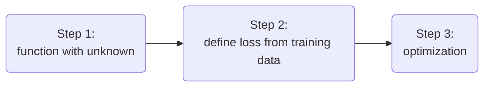

<head>
    
    
</head>

Machine Learning ≈ Looking for Function

Speech Recognition 

一个函数（声音）= 语言

Image Recognition

Playing Go

## Different types of Function

### **Regression**

The function outputs a scalar

> Predict PM2.5
>
> Input: PM2.5 today, temperature Concentration of O~3~
>
> output: PM2.5 of tomorrow

### **Classification**

Given options (class), the function outputs the correct one.

### **Structured Learning**

create something with struction (image,document)

How to find a function ? A case study 

The function we want to find ……

1. #### Function with Unknown Parameters(写一个带有未知参数的函数)

   **model：** y=b+wx~1~ based on domain knowledge

   y: no.of views on 2/26

   x~1~：no.of views on 2/25

   w and b are unknown <u>parameters</u>（参数） (learned from data)

   w  **weight**

   b **bias**

2. #### Define Loss from Training Data

   - Loss is a function of parameters $L(b,w)$

   - Loss: how good a set of values is.

     $L(0.5k,1)$ y=b+wx~1~ $\to$ y=0.5k+1x~1~

   - Training Data: Data from 2017/01/01 - 2020/12/31

$L=\frac{1}{N}\underset{n}{\sum} e_n$表示的意思是损失函数，损失函数越大，预测的结果越不好，$e_n$是表示预测值和真实值的差距$e=|y-\hat{y}|$ L is mean absolute error(MAE) 或者是平方的方式（MSE）

If $y$ and $\hat{y}$ are both probability distributions $\Rightarrow$ Cross-entropy

**Model**   $y=b+wx_1$

3. #### Optimization   

   w^*^,b^*^=$arg \ \underset{w,b}{min}L$
   
   ***<u>Gradient Decent</u>***

先不考虑b只考虑w：

- (Randomly) Pick an initial value w^0^
- Compute $ \frac{\partial L}{\partial w}|_{w=w^0} $

:arrow_double_up:表示的是 negative

$η:leaning\ rate$

需要自己设定的参数：`hyperparameters`

w^1^$\leftarrow$w^0^-$η\frac{\partial L}{\partial w}|_{w=w^0}$

- Update w iteratively

  最后会慢慢停下来，让结果趋近于**局部的最优解**$\to$但是没有办法到**全局的最优解**

  停止的情况：a. 超过迭代的次数 b. 当偏导数等于0的时候

> Does local minimum truly cause the problem?

- (Randomly) Pick initial values w^0^,b^0^

- Compute  $η\frac{\partial L}{\partial w}|_{w=w^0,b=b^0}$

  Can be done in one line in most deep learning frameworks

- Update w and b interactively(两个步长进行一个向量相加，然后进行向量合成之后的行动路线)

**Machine learning is so simple......**

y = 0.1k + 0.97x~1~ achieves the smallest loss L = 0.48k on data of 2017-2020 (**training data**)
How about data of 2021 (**unseen during training**)

现在的模型是利用前一天来对现在这一天来进行预测，可以将预测的天数增加，可以降低损失函数，同时提高预测的精确度。

这一类的模型都属于linear model

**Linear model is too simple …… so we need more sophisticated model**

red curve= constant + sum of a set of 蓝色折线

<u>All piecewise linear curves</u>分段线性曲线= red curve = constant + sum of a set of 蓝色折线

一个平滑的曲线是可以通过取点来转化成一个分段线性曲线，取的点越多，最后的精度越高，逐渐接近连续的曲线。

How to represent this function?

当x趋于无穷大的时候，y会收敛到一个接近c的位置，当x趋于无穷小的时候会接近0，和上述的蓝色折线相似。

y=c sigmoid(b+wx~1~)（和图中的公式相同，作为更简单的表示方式）

所以将上述的式子进行简化可以把公式变化为$y=b+\underset{i}{\sum}c_i\ sigmoid(b+wx_i)$

### New model : More features

#### Step1: function with unknown

#### Final 运算过程

$x$表示**feature** 

$W \ b(grey) \ c^T \ b(green)$表示**Unknown** **parameters**

#### Step2: define loss from training data

Loss

- Loss is a function of parameters $L(\theta)$
- Loss meanshow good a set of values is.

#### Step3: Optimization

$\theta^*=arg \ \underset{\theta}{min}\ L$

- (randomly) Pick initial values $\theta^*$

  
  
- compute gradient:
   $gradient(g)=▽L(\theta^0)$
  
  
  
  

- compute gradient:

  $gradient(g)=▽L(\theta^1)$

……直到无法再继续计算的时候

Optimization of New Model

<u>***Example One***</u>

- 10,000 examples(N=10,000)
- Batch size is 10(B=10)

How many update in 1 epoch?

> **<u>*1,000 updates*</u>**

<u>***Example Two***</u>

- 1,000 examples(N=1,000)
- Batch size is 100(B=100)

How many update in 1 epoch?

> **<u>*1,0 updates*</u>**

#### **Name: Neural Network**

this mimics human brains……(???)

hidden layer

Many layers means **Deep** $\Rightarrow$ Deep Learning!

Deep = Many hidden layers

Why don't we go deeper? 在训练资料上，层数更多不一定代表着在测试集中会有更好的表现$\Rightarrow$**Overfitting**
